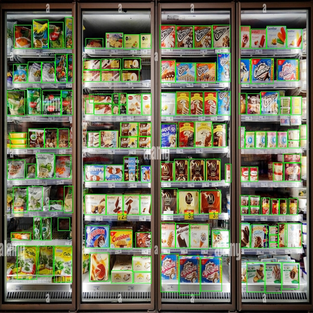
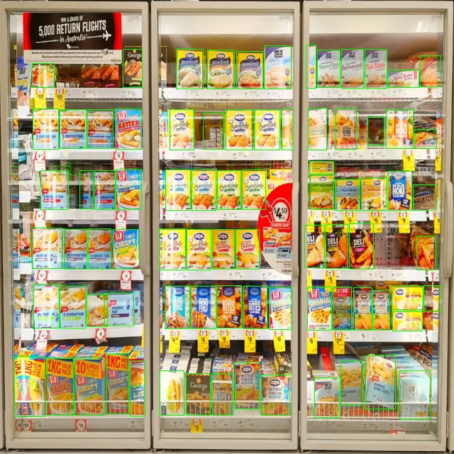
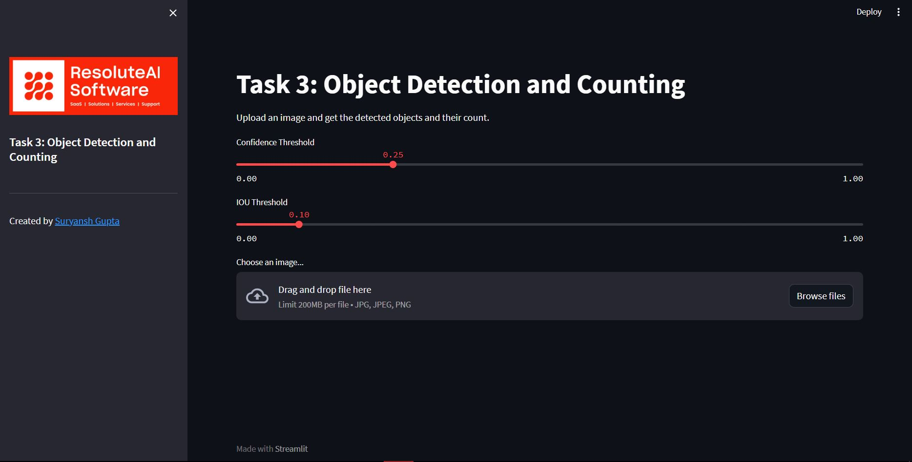
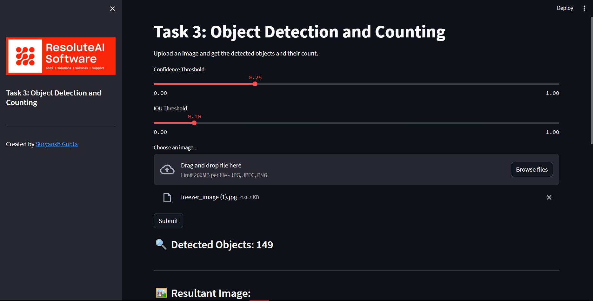
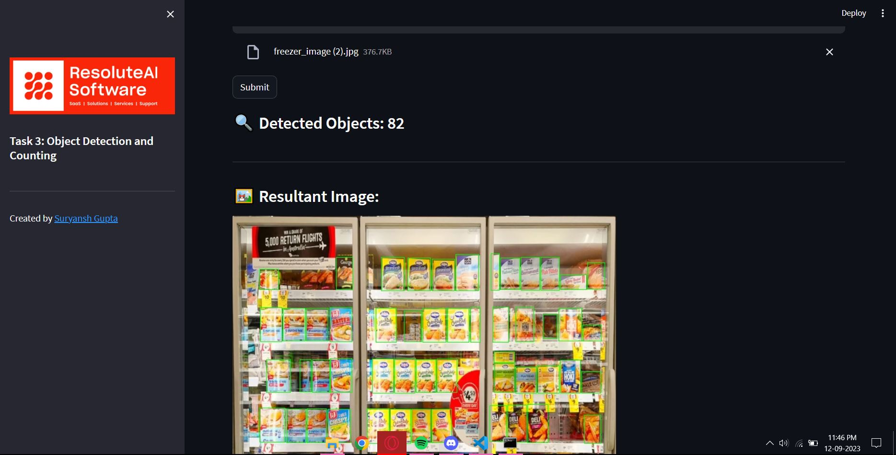

# Task 3: ResoluteAI - Object Detection and Counting
This repository contains the code for the task 3 of the ResoluteAI screening process.

## Table of Contents
- [Problem Statement](#problem-statement)
- [Approach](#approach)
- [Model Weights](#model-weights)
- [Installation](#installation)
- [Model Performance](#model-performance)
- [Streamlit App](#streamlit-app)
- [Results](#results)
- [Limitations](#limitations)

## Problem Statement
The problem statement is to detect and count the number of objects in an image. The images consist of dense environment like inside of a freezer in a super market.

## Approach
I trained a custom YOLOv5x with SKU-110K dataset for educational and research purposes a few months back. I used the same model to detect objects in dense environments. For more information you check out this repository.

Link: [Dense-Object-Detection](https://github.com/suryanshgupta9933/Dense-Object-Detection)

## Model Weights
The weights for the model are not added in the repository due to their large size but can be downloaded from [here](https://drive.google.com/file/d/1BRlXZD9MqYAYYnciMRQ50Mht9kBncf0l/view?usp=sharing).

> Note: You need to add the weights in the root directory of the repository.

## Installation
1. Clone the repository
```bash
git clone https://github.com/suryanshgupta9933/task3-resoluteai.git
```
2. Install the requirements
```bash
pip install -r requirements.txt
```

## Model Performance
The model performs really well on the images with dense environments. Detections on the sample data is shown below:

Index | Sample Data             |  Resultant Image
:----:|:-----------------------:|------------------------
1.|.jpg)|
2.|.jpg)|

## Streamlit App
The model is deployed using Streamlit. The user can upload the image and the model will detect the objects in the image and count them. The app can be run using the following command:
```bash
streamlit run app.py
```
The screenshot of the app is shown below:



## Results
The default settings for confidence threshold and IoU threshold are 0.25 and 0.1 respectively. This can be changed in the sidebar of the web app.

> Note: The increasing the confidence threshold will result in lesser number of detections and increasing the IoU threshold will result in more overlapping bounding boxes leading to incorrect counting of objects.

The results for the sample data is shown below:
1. Freezer Image 1

2. Freezer Image 2


## Limitations
- The model is trained on SKU-110K dataset which consists of images of products in a super market. The model will not perform well on images of other environments.
- The confidence threshold and IoU threshold are set manually. This can be automated by using a validation set and selecting the best values for the thresholds.
